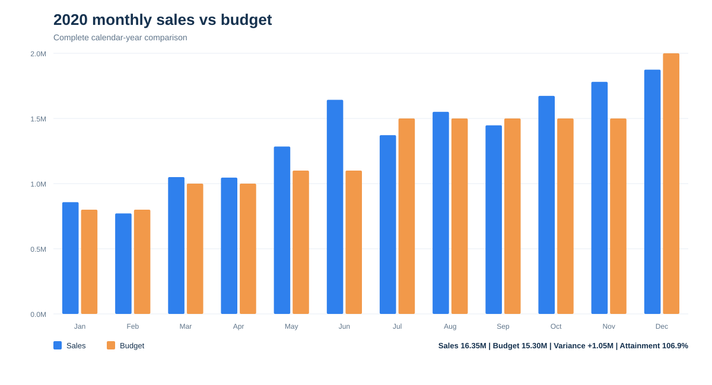
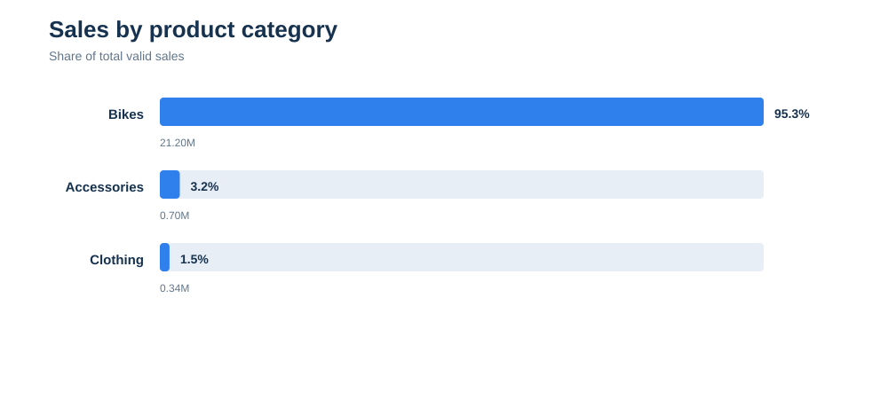
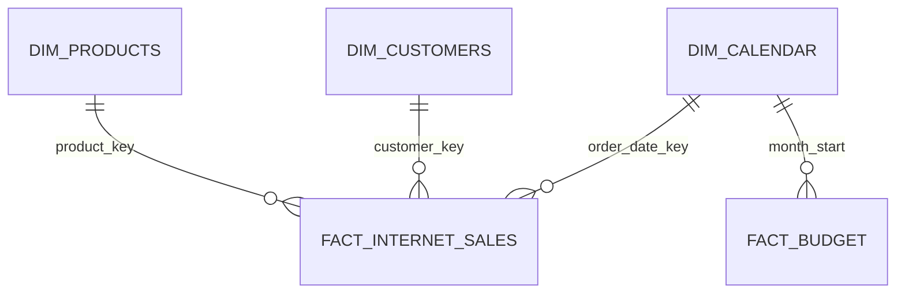

# Sales Performance & Budget Analysis

一个面向数据分析岗位作品集的销售分析项目。项目使用 PostgreSQL 风格 SQL 清洗维表和事实表，以 Python 固化数据质量检查与结果复现，并为 Power BI 提供星型模型、DAX 度量值和 Dashboard 重建规范。

> 项目结论全部由 `src/build_dataset.py` 从源数据计算生成。没有手工补数，也没有把缺失月份当作零销售。

## 业务问题

- 实际销售额是否达到月度预算？
- 销售增长主要来自哪些产品品类和产品？
- 哪些客户和城市贡献较高？
- 数据覆盖范围是否足以支持同比、预算差异和趋势结论？

## 已验证结果

数据覆盖 2019-01-01 至 2021-01-28。清洗后保留 58,166 条销售明细、25,427 个订单和 18,222 位有交易客户。

- 全期间销售额：22,236,875.85。
- 2020 年销售额：16,351,550.34；预算：15,300,000.00。
- 2020 年预算差异：+1,051,550.34；预算达成率：106.9%。
- 2020 年 12 个月中有 8 个月达到或超过预算。
- Bikes 销售额 21,196,343.28，占全期间销售额约 95.3%，品类集中度很高。
- 销售额最高的单品为 `Mountain-200 Black, 46`，销售额 1,371,420.45。

发现两条 `order_date_key = 20190229` 的无效日期记录。管道将其写入审计文件并从事实表排除，而不是静默修正为其他日期。

预算数据延伸到 2021-06，但销售数据只到 2021-01-28。为避免把“缺少销售数据”误判成“零销售”，预算达成结论限定在完整的 2020 自然年。





## 数据模型



模型将每日销售事实与月度预算分开保存。预算通过日期维表的 `month_start` 关联，避免直接用月份文本连接。

## 技术实现

- SQL：源表契约、维表/事实表视图、数据质量检查、预算差异与 Top N 查询。
- Python：编码识别、字段标准化、日期键验证、可复现 KPI、结果核对和预览图生成。
- Power BI：星型模型、日期表、预算与同比度量值、页面布局和刷新检查清单。
- DAX：Budget Variance、Budget Attainment、Average Order Value、Sales LY、YoY Growth、Sales YTD 等。

## 快速复现

```powershell
python -m venv .venv
.venv\Scripts\Activate.ps1
python -m pip install -r requirements.txt
python src/build_dataset.py
python src/validate_project.py
python src/create_charts.py
```

验证成功时会输出：

```text
PASS: keys, relationships, audited exclusions, KPI totals and the 12-month 2020 budget comparison reconcile.
```

然后在 Power BI Desktop 中导入 `data/processed` 下的模型表，按 [Power BI 重建说明](powerbi/README.md) 建立关系并添加 [DAX 度量值](dax/measures.dax)。

## 项目结构

```text
01_SQL_PowerBI_Sales_Analysis/
├─ data/
│  ├─ raw/                  # 上游源文件
│  ├─ processed/            # 管道生成的模型表、KPI 与审计结果
│  └─ README.md             # 数据获取、口径和限制
├─ sql/                     # PostgreSQL 建模、质量检查和分析查询
├─ dax/                     # Power BI 度量值
├─ powerbi/                 # 上游参考 PBIX 与作品集版重建说明
├─ src/                     # 数据管道、验证和制图代码
├─ images/                  # 由本项目数据管道生成的预览图
├─ docs/                    # 数据字典和上游 README 快照
└─ requirements.txt
```

## 相比参考项目的实质改造

- 将散落在根目录的 SQL、数据和 PBIX 重组为可维护的分析工程。
- 修正 `Gendar`、`InternerSales` 等命名问题，并用真正的日期类型替代字符串年份判断。
- 修复按首购年份过滤客户维表造成的 6,714 条事实记录客户键失配。
- 增加源字段契约、主键检查、外键覆盖检查和无效日期审计。
- 将预算与销售的可比期间明确限定为完整 2020 年，避免误导性达成率。
- 增加可重复运行的 Python 数据管道、KPI JSON、校验脚本和自动生成图表。
- 增加 Power BI 星型模型说明和可直接录入的 DAX 度量值。
- 重写 README，使业务问题、方法、结果、限制和复现步骤都可在面试中解释。

## Power BI 文件说明

`powerbi/upstream_sales_dashboard.pbix` 是上游参考文件，不作为本项目原创 Dashboard 声明。当前环境未安装 Power BI Desktop，因此没有直接改写二进制 PBIX。作品集版应按 `powerbi/README.md` 用处理后的数据重新搭建，并在本机 Power BI 中完成刷新和截图验证。

## 来源与许可

项目参考 [khaled-gohar/SQL_PBI_SalesAnalysis](https://github.com/khaled-gohar/SQL_PBI_SalesAnalysis)。保留原作者归属和上游 README 快照。

上游快照没有 `LICENSE` 文件，因此不能把“公开可见”理解为“允许公开再分发”。公开发布前请先取得原作者许可，或替换上游数据、代码和 PBIX。详细说明见 [NOTICE.md](NOTICE.md)。
